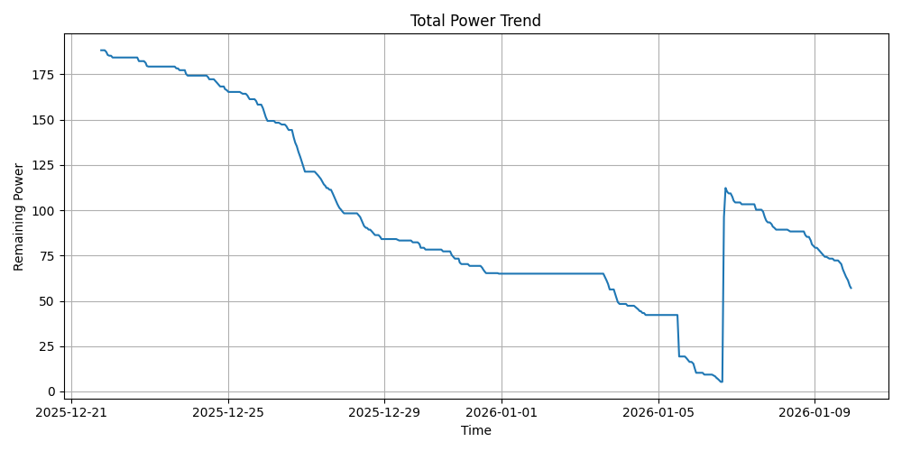
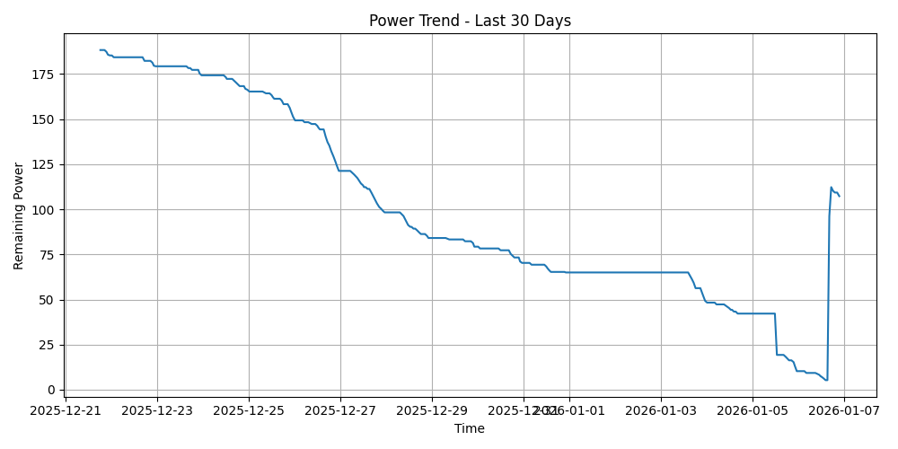
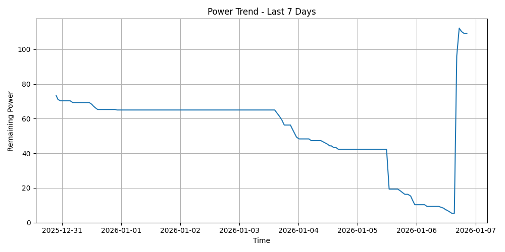
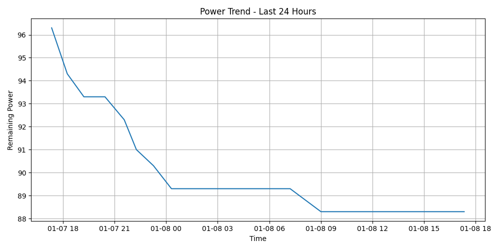

# 🏠 JSPI D520宿舍电费监控

## 📈 总用电趋势图

## 🔌 近30天用电记录

## 📈 近7天用电趋势图

## 🔌 近24小时用电记录

## 📊 每天用电量统计

<!-- DAILY_POWER_TABLE_START -->

| 日期 | 用电量 (度) |
|------|-------------|
| 2025-12-21 | 3.00 |
| 2025-12-22 | 6.00 |
| 2025-12-23 | 5.00 |
| 2025-12-24 | 8.00 |
| 2025-12-25 | 15.00 |
| 2025-12-26 | 30.00 |
| 2025-12-27 | 23.00 |
| 2025-12-28 | 14.20 |
| 2025-12-29 | 4.80 |
| 2025-12-30 | 9.00 |
| 2025-12-31 | 5.30 |
| 2026-01-01 | 0.00 |
| 2026-01-02 | 0.00 |
| 2026-01-03 | 15.70 |
| 2026-01-04 | 7.10 |
| 2026-01-05 | 31.90 |
| 2026-01-06 | 13.00 |
| 2026-01-07 | 14.00 |
| 2026-01-08 | 7.00 |

<!-- DAILY_POWER_TABLE_END -->

👉 [查看完整历史数据](power.txt)
